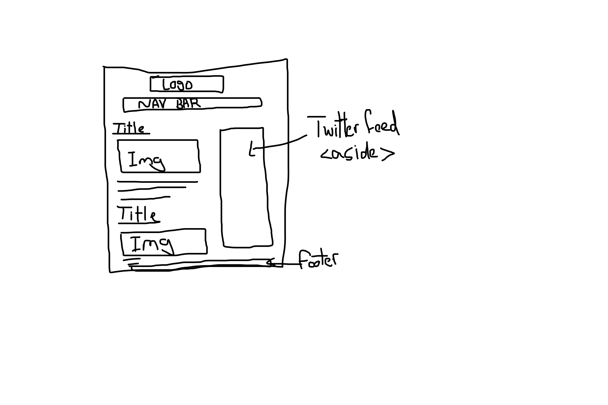

# Code 102 Reading Notes

## My name is Osama Baker. I am new to software development. I am extremely interested in becoming the best software developer I can be.

   Name      |  Link
------------ | -------------
First Read   | [read01](./102/read01.md)
Second Read  | [read02a](./102/read02a.md)
Third Read   | [read02b](./102/read02b.md)
Fourth Read  | [read03](./102/read03.md)
Fifth Read   | [read04a](./102/read04a.md)
Sixth Read   | [read05](102/read05.md)
Seventh Read | [read06](102/read06.md)

This is my wireframe sketch of my website:

# Code 201 Reading Notes

   Name      |  Link
------------ | -------------
Read01       | [Introductory HTML and JavaScript](201/read01.md)
Read02       | [HTML Text, CSS Introduction, and Basic Javascript Instructions](201/read02.md)
Read03       | [HTML Lists, CSS Boxes, JS Control Flow](201/read03.md)
Read04       | [HTML Links, JS Functions, and Introl to CSS Layout](201/read04.md)
Read05       | [HTML Images, CSS Color & Text](201/read05.md)
Read06       | [JS Object Literals: The DOM](201/read06.md)
Read07       | [HTML Tables: JS Contructor Functions](201/read07.md)
Read08       | [More CSS Layout](201/read08.md)
Read09       | [Forms and Events](201/read09.md)
Read10       | [JS Debugging](201/read10.md)
Read11       | [Assorted Topics](201/read11.md)
Read12       | [Docs for the HTML: Element & Chart.js](201/read12.md)
Read13       | [Local Storage](201/read13.md)
Read14a      | [CSS Transforms, Transitions and Animations](201/read14a.md)
Read14b      | [What Google Learned About Teams](201/read14b.md)

# Code 301 Reading Notes

   Name      |  Link
------------ | -------------
Class01      | [Introduction to React and Components](301/class01.md)
Class02      | [State and Props](301/class02.md)
Class03      | [Passing Functions as Props](301/class03.md)
Class04      | [Controlled Component](301/class04.md)
Class05      | [Putting it all together](301/class05.md)
Class06      | [NODE.JS](301/class06.md)
Class07      | [REST](301/class07.md)
class08      | [APIs](301/class08.md)
class09      | [FUNCTIONAL PROGRAMMING](301/class09.md)
class10      | [Understanding the JavaScript Call Stack](301/class10.md)
class11      | [Authentication](301/class11.md)
class12      | [Mongo and Mongoose](301/class12.md)
class13      | [Status Codes Based On REST Methods](301/class13.md)

# Code 401 Reading Notes

   Name      |  Link
------------ | -------------
Pre-Work     | [Advanced Javascript Development](401/prework.md)
Class01      | [Node Ecosystem, TDD, CI/CD](401/class01.md)
Class02      | [Express](401/class02.md)
Class03      | [Express](401/class03.md)
Class04      | [Data Modeling](401/class04.md)
Class05      | [Linked Lists](401/class05.md)
Class06      | [Authentication](401/class06.md)
Class07      | [Bearer Authorization](401/class07.md)
Class08      | [Access Control (ACL)](401/class08.md)
class09      | [Authorization/Authentication](401/class09.md)
class10      | [Event Driven Applications](401/class10.md)
class13      | [Message Queues](401/class13.md)
class14      | [Event Driven Architecture](401/class14.md)
